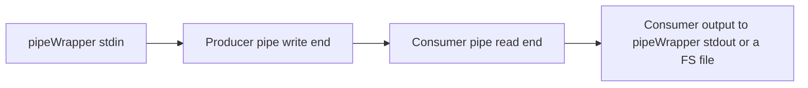
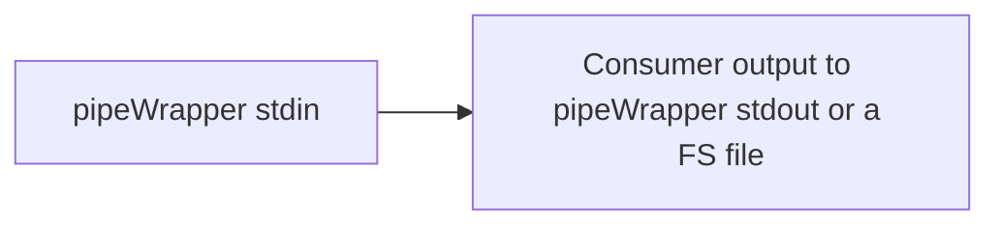

# pipeWrapper tool
https://github.com/Siarhei-Yarkavy/pipeWrapper

## Read this first
### Users 
This tool is indented for experienced users know what is console and pipeline.
### Assumptions
Producer or consumer child tool process uses stderr as logging channel. Files, stdin and stdout for data input and output. 
### Limitations
* At the moment Windows 10+ is supported.
* Producer and consumer cannot write theirs stderr to console and log simultaneously.
* CTRL+C is not supported, CTRL+BREAK should work and tell pipeWrapper to kill 'children' and stop as soon as possible.

## Why pipeWrapper?
Some of us use command-line tools to convert audio, video, or image files. These tools often have complex command-line interfaces and may be chained together in a pipeline, where the output of one tool (the producer) is passed as input to another (the consumer). They are also frequently invoked by third-party GUI applications — such as foobar2000 — to convert files from one format to another. 

All these scenarios introduce challenges in managing command-line options and troubleshooting errors. 

For example, if the producer fails, the consumer often exits with a zero (successful) exit code — even though it may have produced an incomplete or corrupted output file. This misleads the parent application into believing the operation succeeded.  

PipeWrapper addresses this issue by monitoring child process exit codes and ensuring the pipeWrapper itself exits with an appropriate non-zero code, thereby correctly informing the parent application of any failure. 

### Solution
profile
Qwen3-Max-Preview 4:18 pm

Вот грамматически правильный, стилистически улучшенный и профессионально оформленный вариант вашего текста: 
 

The PipeWrapper tool helps address these challenges in the following ways: 
* Profile Management: Store predefined profiles for producer/consumer pairs, including their command-line options — making it easy to manage and reuse complex tool configurations.
* Consumer-Only Mode: PipeWrapper can operate with a consumer only, using consumer-specific profiles. In this mode, it forwards its own standard input (stdin) directly to the consumer’s stdin.
* Comprehensive Logging: Capture all stderr output — from PipeWrapper itself, the producer, and the consumer — into log files for easy troubleshooting when something goes wrong.
* Dynamic Argument Substitution: Support passing command-line arguments to both producer and consumer, with placeholder values that can be dynamically replaced at runtime.
     

## How to use

### Data flows
To understand pipeWrapper tool usage it is good to understand how data flow inside the tool works. 

#### Producer and consumer both
Simplified flow diagram:

#### Consumer is used only
Simplified flow diagram:

### Basic concepts
* **Profile.** 
    A named directory in **the same folder where pipeWrapper is located**
    Profile has `consumer.json` and `producer.json` files with command line parameters
    and optional placeholders `%1`, `%2` etc. that are replaced with passed command line arguments.

    **Absence of `producer.json` is considered as consumer only mode.**
      
* **Logging mode**.
  * Nul mode when all logs from PipeWrapper and 'children' stderr are redirected to nul (recommended for "production").
  * Silent mode without any logging from PipeWrapper but logging from 'children' is captured.
  * Console only mode (not useful when running from third-party tools).
  * File only mode. Logs are saved to current working directory (Possible for "production").
  * Both console and file mode (inclusive mode).
    
* **Run id**. 
    An "unique" id of the current execution and is part of log files name.
    Allows you to correlate log files with a specific launch.
      
* **Timeout**. 
    Timeout to complete pipe before forcing to kill 'children'. `0` means wait forever.

### Command line
For the moment pipeWrapper is configured via command line only.
Run `pipeWrapper --help` to get command line hints. 
Run `pipeWrapper --version` to get version info. 

#### Key command line parameters:

`--profile=<profile dir>` 
Profile name, required. Name of a folder located next to the pipeWrapper executable.
Use `NUL` as profile name to run direct pipe without stored configuration.
This case producer and consumer commandline strings must be provided as pipeWrapper arguments.

`--lmode=(INCL|FILE|CON|SIL|NUL)` 
Logger mode in one of INCL, FILE, CON, SIL, NUL, default is `SIL`

`--t=<timeout>` 
Timeout in seconds before force terminating 'children' processes, **default is `300`**
  
To avoid collision put `--` before profile placeholders arguments and put them after options.

#### Examples of a commandline arguments:

*Audio transcoding with adjusting volume* 
`pipeWrapper.exe --lmode=NUL --profile=AAC_VOLUME --  -1 "out file.m4a"`

*Direct pipe without configuration* 
`pipeWrapper.exe --lmode=FILE --profile=NUL --  "\"path\producer.exe -opt1 value1\"" "\"path\consumer.exe -arg2\""`

*Video transcoding* 
`pipeWrapper.exe --t 0 --lmode=FILE --profile=FFMPEG_TR -- "d:\videotemp\out file.mkv" < source.mkv`

### Configuration examples
Profile data examples are located in `Examples` folder.
Copy a subfolder to the pipeWrapper executable folder.

### Return codes
https://github.com/Siarhei-Yarkavy/pipeWrapper/blob/529da9cdc046c8ebfdd28335a5faa9eb977ad6c2/src/nativeMain/kotlin/org/sergy/pipewrapper/Core.kt#L26

