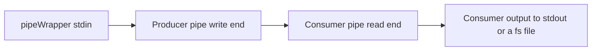

# pipeWrapper tool
https://github.com/Siarhei-Yarkavy/pipeWrapper

## Read this first
### Users 
This tool is indented for experienced users know what is console and pipeline
### Limitation
* At the moment Windows 10+ is supported
* Producer and consumer cannot write stderr to console and log simultaneously

## Why pipeWrapper?
## Problem
Some of us use commandline audio/video/image converters. 
Those tools might have complex command line
and might be joined in a pipe to route output data from the first tool(producer) to the second tool(consumer).
Also, such tools are used from third-party GUI applications
like foobar2000 to convert from certain audio/video/image
to a different one. All these scenarios have complications
in managing commandline arguments and troubleshooting errors 

## Solution
pipeWrapper tool helps here in the following way:
* Has a feature to use stored profiles for consumer/producer pairs
and keep theirs commandline arguments in the profiles.
* Able to work with consumer only
and pass pipeWrapper stdin to consumer stdin with full consumer profile support.
* Log all stderr from pipeWrapper, producer and consumer 
to log files to easily troubleshoot if something is going wrong.
* Support passing arguments to producer and consumer that could be used as placeholders values.

## How to use

### Data flows
To understand pipeWrapper tool usage it is good to understand how data flows work. 

#### Producer and consumer both
Simplified flow diagram:

#### Consumer is used only
Simplified flow diagram:

### Basic concepts
* Profile.
 
    A named directory in **the same folder where pipeWrapper is located**. 
    Profile has `consumer.json` and `producer.json` files with command line parameters
    and placeholders `%1`, `%2` etc. to replace with passed command line arguments.
  
    **Absence of `producer.json` is considered as consumer only mode.**
  
* Logging mode
  * Silent mode without any logging
  * Console only logging (not useful when running from third-party tools)
  * File(s) only (recommended). Save logs to working directory
  * Both console and file(s) mode (inclusive mode)

### Commandline
run `pipeWrapper --help` to get commandline hints. 
To avoid collision put `--` before profile placeholders arguments
and put them after options.
Example of a commandline arguments:

`pipeWrapper.exe --lmode INCL --profile AAC_VOLUME --  -1 "out file.m4a"`

### Examples
Example of a profile is located in `Examples` folder.
Copy a subfolder to the pipeWrapper executable folder.

