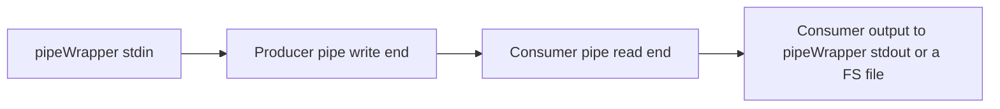
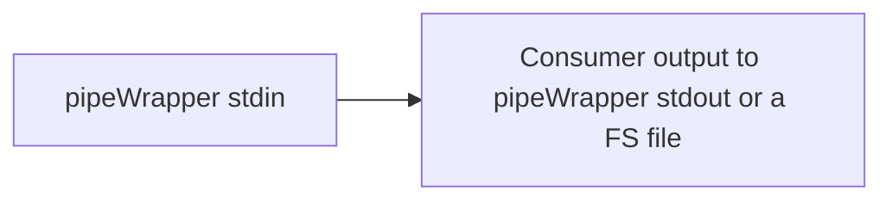

# pipeWrapper tool
https://github.com/Siarhei-Yarkavy/pipeWrapper

## Read this first
### Users 
This tool is indented for experienced users know what is console and pipeline.
### Assumptions
Producer or consumer child tool process uses stderr as logging channel. Files, stdin and stdout for data input and output. 
### Limitations
* At the moment Windows 10+ is supported.
* Producer and consumer cannot write theirs stderr to console and log simultaneously.
* CTRL+C is not supported, CTRL+BREAK should work and tell pipeWrapper to kill 'children' and stop as soon as possible.

## Why pipeWrapper?
### Problem
Some of us use commandline audio/video/image converters. 
Those tools might have complex command line
and might be joined in a pipe to route output data from the first tool(producer) to the second tool(consumer).
Also, such tools are used from third-party GUI applications
like foobar2000 to convert from certain audio/video/image formats
to a different ones. All these scenarios have complications
in managing command line options and troubleshooting errors.
 
For instance, if a producer fails, consumer very often exist with incomplete output file but 0 successful exit code.
Parent app is misinformed.
Pipe Wrapper controls child process exit codes and exits with corresponded non-zero code
to inform the patent application about failure.

### Solution
PipeWrapper tool helps here in the following way:
* Use stored profiles for consumer/producer pairs
and keep theirs command line options in the profiles to manage tools and command lines easily.
* is able to work with consumer only and use consumer profiles only.
It works as pipeWrapper passes own stdin to consumer stdin.
* Capture all stderr from pipeWrapper, producer and consumer 
to log files for easy troubleshooting if something is going wrong.
* Support passing command line arguments for producer and consumer that could be used as placeholders values.

## How to use

### Data flows
To understand pipeWrapper tool usage it is good to understand how data flow inside the tool works. 

#### Producer and consumer both
Simplified flow diagram:

#### Consumer is used only
Simplified flow diagram:

### Basic concepts
* **Profile.** 
    A named directory in **the same folder where pipeWrapper is located**
    Profile has `consumer.json` and `producer.json` files with command line parameters
    and optional placeholders `%1`, `%2` etc. that are replaced with passed command line arguments.

    **Absence of `producer.json` is considered as consumer only mode.**
      
* **Logging modes**.
  * Nul mode when all logs from PipeWrapper and 'children' stderr are redirected to nul (recommended for "production").
  * Silent mode without any logging from PipeWrapper but logging from 'children' is captured.
  * Console only logging (not useful when running from third-party tools).
  * File(s) only. Logs are saved to current working directory (Possible for "production").
  * Both console and file(s) mode (inclusive mode).
    
* **Run id**. 
    An "unique" id of the current execution and is part of log files name.
    Allows you to correlate log files with a specific launch.
      
* **Timeout**. 
    Timeout to complete pipe before forcing to kill 'children'. `0` means wait forever.

### Command line
For the moment pipeWrapper is configured via command line only.
Run `pipeWrapper --help` to get command line hints. 
Run `pipeWrapper --version` to get version info. 

#### Key command line parameters:

`--profile=<profile dir>` 
Profile name, required. Name of a folder located next to the pipeWrapper executable.
Use `NUL` as profile name to run direct pipe without stored configuration.
This case producer and consumer commandline strings must be provided as pipeWrapper arguments.

`--lmode=(INCL|FILE|CON|SIL|NUL)` 
Logger mode in one of INCL, FILE, CON, SIL, NUL, default is SIL

`--t=<timeout>` 
Timeout in seconds before force terminating 'children' processes, **default is `300`**
  
To avoid collision put `--` before profile placeholders arguments and put them after options.

#### Examples of a commandline arguments:

*Audio transcoding with adjusting volume* 
`pipeWrapper.exe --lmode=NUL --profile=AAC_VOLUME --  -1 "out file.m4a"`

*Direct pipe without configuration* 
`pipeWrapper.exe --lmode=FILE --profile=NUL --  "\"path\producer.exe -opt1 value1\"" "\"path\consumer.exe -arg2\""`

*Video transcoding* 
`pipeWrapper.exe --t 0 --lmode=FILE --profile=FFMPEG_TR -- "d:\videotemp\out file.mkv" < source.mkv`

### Configuration examples
Profile data examples are located in `Examples` folder.
Copy a subfolder to the pipeWrapper executable folder.

### Return codes
https://github.com/Siarhei-Yarkavy/pipeWrapper/blob/cf2d416c20c9955dd40a46ad4fc61badfe6bae4d/src/nativeMain/kotlin/org/sergy/pipewrapper/Core.kt#L27

