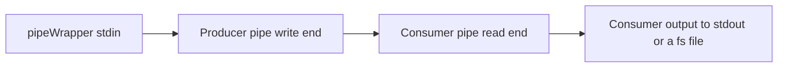
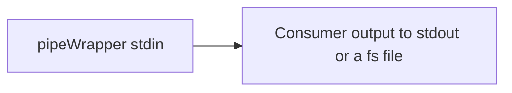

# pipeWrapper tool
https://github.com/Siarhei-Yarkavy/pipeWrapper

## Read this first
### Users 
This tool is indented for experienced users know what is console and pipeline.
### Assumptions
Producer or consumer child tool uses stderr as logging channel. Files, stdin and stdout for data input and output. 
### Limitations
* At the moment Windows 10+ is supported.
* Producer and consumer cannot write theirs stderr to console and log simultaneously.

## Why pipeWrapper?
### Problem
Some of us use commandline audio/video/image converters. 
Those tools might have complex command line
and might be joined in a pipe to route output data from the first tool(producer) to the second tool(consumer).
Also, such tools are used from third-party GUI applications
like foobar2000 to convert from certain audio/video/image formats
to a different ones. All these scenarios have complications
in managing command line options and troubleshooting errors.
 
For instance, if a producer fails, consumer very often exist with incomplete output file but 0 successful exit code. Parent app is misinformed.
Pipe Wrapper controls child exit codes and exits with corresponded non zero code to inform the patent application about failure.

### Solution
pipeWrapper tool helps here in the following way:
* Has a feature to use stored profiles for consumer/producer pairs
and keep theirs command line options in the profiles.
* Is able to work with consumer only and use consumer profiles only.
It works as passing pipeWrapper stdin to consumer stdin.
* Capture all stderr from pipeWrapper, producer and consumer 
to log files for easy troubleshooting if something is going wrong.
* Support passing command line arguments for producer and consumer that could be used as placeholders values.

## How to use

### Data flows
To understand pipeWrapper tool usage it is good to understand how data flow inside the tool works. 

#### Producer and consumer both
Simplified flow diagram:

#### Consumer is used only
Simplified flow diagram:

### Basic concepts
* **Profile.** 
        A named directory in **the same folder where pipeWrapper is located**. 
        Profile has `consumer.json` and `producer.json` files with command line parameters
        and placeholders `%1`, `%2` etc. to replace with passed command line arguments.

    **Absence of `producer.json` is considered as consumer only mode.**

* **Logging mode**.
  * Silent mode without any logging
  * Console only logging (not useful when running from third-party tools)
  * File(s) only (recommended). Save logs to working directory
  * Both console and file(s) mode (inclusive mode)

### Command line
Run `pipeWrapper --help` to get command line hints. 
Run `pipeWrapper --version` to get version info. 
 
To avoid collision put `--` before profile placeholders arguments
and put them after options.
Example of a commandline arguments:

`pipeWrapper.exe --lmode INCL --profile AAC_VOLUME --  -1 "out file.m4a"`

CTRL+C is not supported, CTRL+BREAK should work and tell the program to stop as soon as possible.
### Examples
Profile data examples are located in `Examples` folder.
Copy a subfolder to the pipeWrapper executable folder.

### Return codes
https://github.com/Siarhei-Yarkavy/pipeWrapper/blob/cf2d416c20c9955dd40a46ad4fc61badfe6bae4d/src/nativeMain/kotlin/org/sergy/pipewrapper/Core.kt#L27

